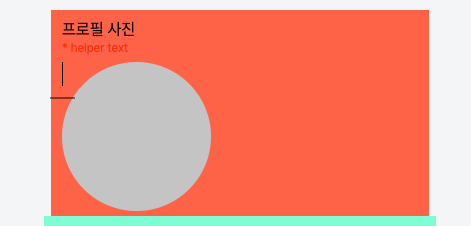
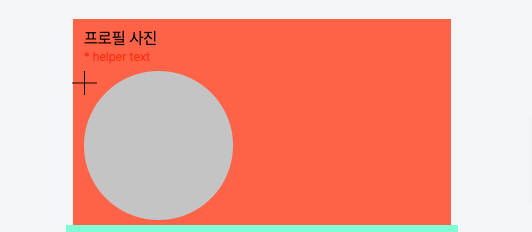
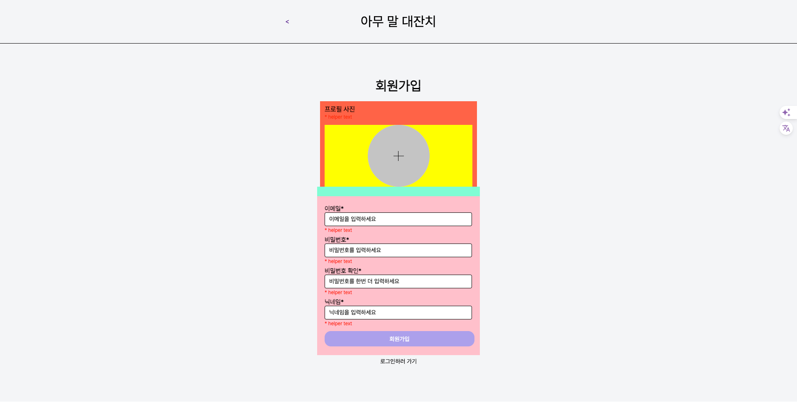

# TIL

## 날짜: 2024-04-05

### 스크럼

- 학습 목표 : 딥다이브, 과제2(회원가입, 게시글목록조회, 가능하면 회원정보 수정까지), 깃 업로드, 딥다이브와 오늘활동 정리
- 예상되는 이슈 : css 정렬에 매번 애를 먹는다. 그떄문에 시간이 좀 걸릴 수 있다.
- 작일 회고 : 팀활동 시간이 길어 예정보다 과제에 들이는 시간이 적었다. 목표만큼 다 끝내지 못했지만 과제를 다 끝내니 12시였다. 환경세팅에도 시간을 많이 들였으니 오늘부터는 좀 더 속도를 내고 싶다.

### 새로 배운 내용

#### 주제 1: CSR, SSR, SSG

### 오늘의 도전 과제와 해결 방법

- 도전 과제 1: feature / 회원가입 화면 레이아웃 완료 #4

### 회원가입 레이아웃 및 정렬

##### 직면한 문제 : 이미지 삽입 내 플러스 기호를 직접 구현하고 싶은데

1. 어떻게 구현해야 할지
   **`<span>`태그를 사용하여 선 두개를 만들고, 하나를 회전시켜 + 기호 구현**

```css
.inner .imgContainer .mid span:first-child {
  display: block;
  display: flex;
  justify-content: center;
  align-items: center;
  background-color: black;
  width: 1px;
  height: 24px;
}

.inner .imgContainer .mid span:last-child {
  display: block;
  background-color: black;
  width: 1px;
  height: 24px;
  transform: rotate(90deg);
}
```

2. 저 기호가 왜 동그란 원안에 안들어오는지 헤맸다.
   

**첫번째 시도**

```css
transform: translate(0, -24px) rotate(90deg);
```


이렇게 했지만, 해당 방법으로는 원 중앙에 플러스가 오는 방법을 찾지 못함.

**두번째 시도**
`translate(0, -24px)` 삭제, 두 개의 span태그를 div로 감싸고, 겉에 flex로 중앙정렬을 넣어주어 해결

```html
<div class="imgBox">
  <div class="mid">
    <!-- 플러스 기호 span으로 표현 -->
    <span></span>
    <span></span>
  </div>
</div>
```

```css
.inner .imgContainer .imgBox {
  background-color: yellow;
  display: flex;
  justify-content: center;
  align-items: center;
}

.inner .imgContainer .mid {
  display: flex;
  justify-content: center;
  align-items: center;
  background-color: #c4c4c4;
  width: 149px;
  height: 149px;
  border-radius: 50%;
}
```



- 도전 과제 2: jeff 코드리뷰 반영, 회원가입페이지 - 이미지업로드 부분 input으로 변경 #5

#### index.html

**잘못된 코드 정정**

```html
<!--    뷰포트 메타 태그는 다음과 같이 써야 합니다. "DD"는 올바른 값이 아닙니다. -->
<!--    <meta name="viewport" content="width=DD, initial-scale=1.0" />-->
<meta
  name="viewport"
  content="width=device-width, user-scalable=no, initial-scale=1.0, maximum-scale=1.0, minimum-scale=1.0"
/>
<!--  메타태그 문법은 아래와 같습니다!  -->
<!--    <meta og:title="Log in" />-->
<!--    <meta og:description="로그인할 수 있는 페이지" />-->
<meta property="og:title" content="Log in" />
<meta property="og:description" content="로그인할 수 있는 페이지" />
```

**`form` 태그와, `label` 태그 반영.**

```html
<main>
  <div class="inner">
    <h2>로그인</h2>
    <!--        관례상 .container 라는 css 클래스는 페이지 레이아웃 상 최상단 (body 바로 밑 혹은 레이아웃 상 메인 컨텐츠가 포함된 div) 블럭에 적용합니다. -->
    <div class="container">
      <!--        이 부분은 (.inputs) div가 아닌 form 태그를 써야 서버에 데이터가 전송됩니다. -->
      <form method="post" action="서버의url" id="login-form" class="inputs">
        <!-- 위에서 폼 태그를 사용했다면 이 부분은 label 태그로 사용하는 것을 권장합니다. 사용자 편의성이 올라 갈 수 있습니다. -->
        <!-- 사용자 편의성이 어떻게 올라가는 지는 아래 링크를 통해 테스트해보세요 -->
        <!-- https://www.tcpschool.com/examples/tryit/tryhtml.php?filename=html_ref_tag_label_01 -->
        <!-- 위 링크에 나와 있는 lable 태그 하나를 `<div style="display:inline-block;">10대</div><br>` 로 정의하고 마우스를 클릭해보시면 그 차이가 나옵니다. -->
        <!-- *(label인 경우에는 그 주변 요소를 클릭해도 선택이 되는 점)-->
        <label class="input">
          <p class="email">이메일</p>
          <input type="email" placeholder="이메일을 입력해주세요" />
        </label>
        <label class="input">
          <p class="pwd">비밀번호</p>
          <input type="password" placeholder="비밀번호를 입력해주세요" />
        </label>
        <div class="red">* helper text</div>
      </form>
    </div>
    <!-- 이렇게 하면, 로그인 클릭시 메인으로 안넘어간다. 맞는지?  -->
    <button type="submit" form="login-form" class="btn">
      <a class="login" href="./public/html/main.html">로그인</a>
    </button>
    <div class="link">
      <a class="signin" href="./public/html/signin.html">회원가입</a>
    </div>
  </div>
</main>
```

**문제상황**
css 때문에, form 외부에 submit 버튼이 존재해야하는 상황
`<button type="submit" form="login-form" class="btn">` 로 작성하여 외부에 위치함.

```html
<!-- 이렇게 하면, 로그인 클릭시 메인으로 안넘어간다. 맞는지?  -->
<button type="submit" form="login-form" class="btn">
  <a class="login" href="./public/html/main.html">로그인</a>
</button>
```

**해결 못한 문제**  
왜 submit 버튼 클릭하면, a태그 링크로 안가는지.

#### signin.html

위 피드백을 반영하여 코드 수정.
회원가입 페이지에서는 이미지를 업로드하는 인풋이 필요하다.
js 없이 이를 구현하기 위해

```html
<form method="post" action="서버의url" id="signin-form" class="inputs"></form>
```

**`.imgBox(div)` 안에 별도로 `<input type="file" id="profileUpload">`을 작성.**
해당 요소는 `display:none` 으로 숨김처리.

```css
/* 이미지 인풋 숨기기 */
.inner .imgContainer #profileUpload {
  display: none;
}
```

대신 보여주려는 `.mid(div)`에 `<lable **for ="profileUpload"**>` 를 사용하여 **해당 요소를 클릭해도 파일 업로드**가 수행되도록 설정하였다.

```html
<div class="imgBox">
  <!-- label로 묶어 파일 인풋 가능하도록. id값으로 연결 -->
  <label for="profileUpload" class="file-upload-label">
    <div class="mid">
      <!-- 플러스 기호 span으로 표현 -->
      <span></span>
      <span></span>
    </div>
  </label>
  <!-- display: none -->
  <input type="file" id="profileUpload" name="profilePicture" />
</div>
```

**문제상황**
파일 선택창은 떠도 파일 클릭 시 해당 디브에 이미지가 들어가지 않음. js 문제인 듯 하여 제외.

#### CSS

**자주 쓰는 값은 변수화. root로 설정하여 다른 css파일에서도 적용 가능하다.**

```CSS
/*
아래와 같이 css 변수를 사용하면 유지보수 성을 많이 올릴 수 있습니다.
하나의 변수를 통해 웹 페이지 전체의 스타일을 일관성있게 관리 할 수 있게 됩니다.
*/
:root {
  --main-bg-color: #f4f5f7;
  --btn-purple: #aca0eb;
  --header-height: 104px;
  --input-width: 355px;
  --input-height: 33px;
}
```

### 참고 자료 및 링크

- [딥다이브-CSR/SSR/SSG 정리](https://sen2y-it.tistory.com/7)
- [feature / 회원가입 화면 레이아웃 완료 #4](https://github.com/sen2y/KakaoCloudSchool_CommunityWeb/pull/4)
- [jeff 코드리뷰 반영, 회원가입페이지 - 이미지업로드 부분 input으로 변경 #5](https://github.com/sen2y/KakaoCloudSchool_CommunityWeb/pull/5)
