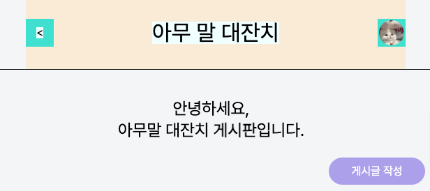
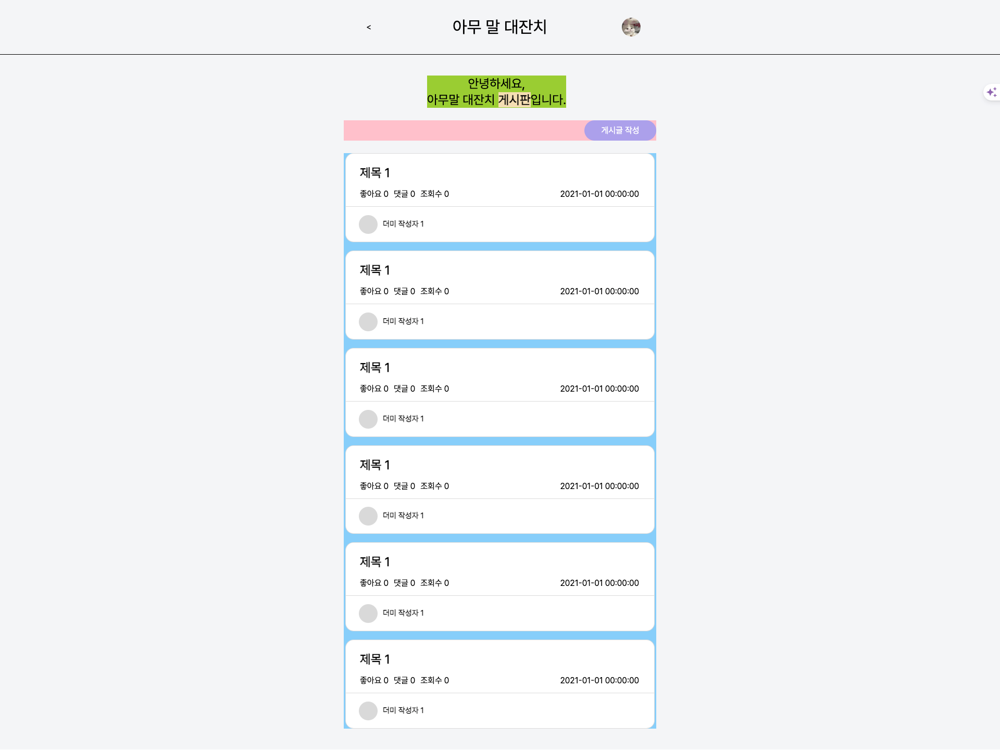
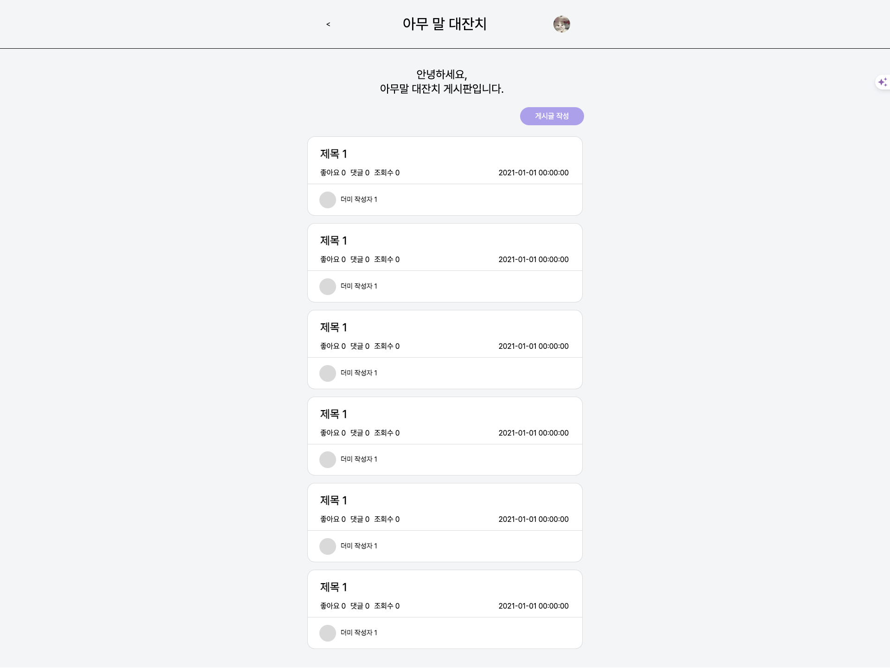
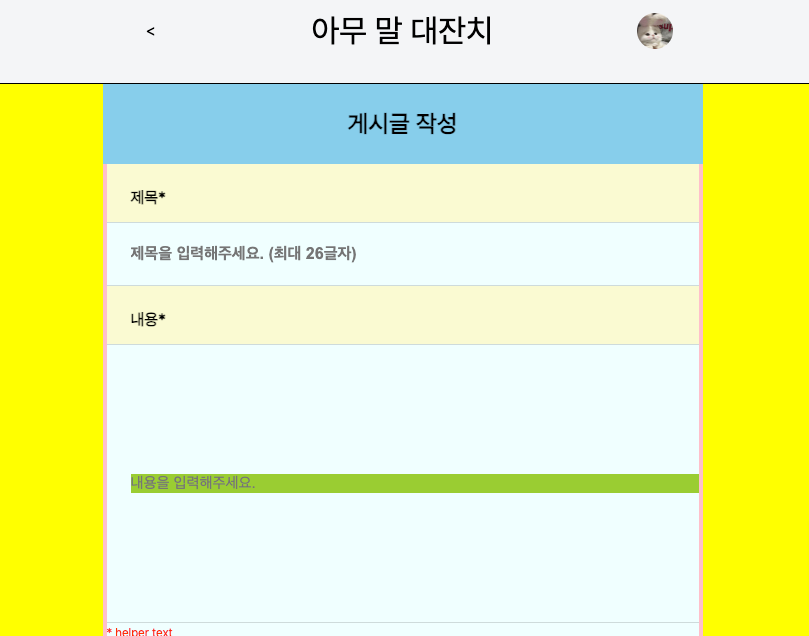
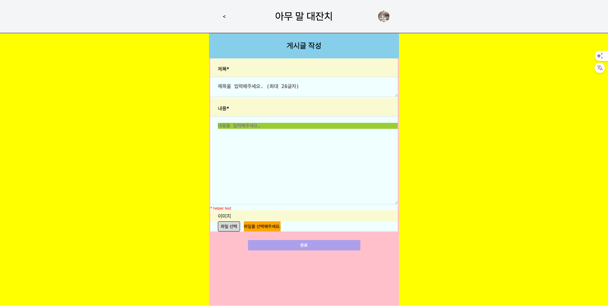
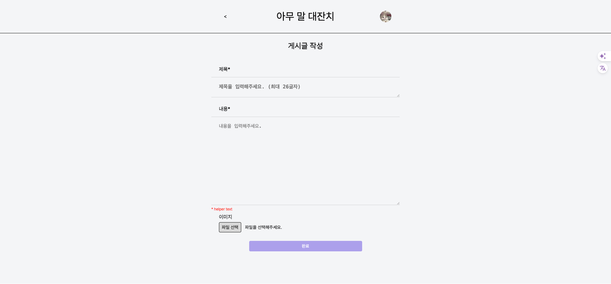

# TIL

## 날짜: 2024-04-06

### 오늘의 도전 과제와 해결 방법

- 도전 과제 1: feature/ 게시글 목록 조회 완료 , span태그 문제해결 #6

##### 공통 헤더(로그인된 버전) 생성

**화살표, 제목, 프로필 `space-between`으로 정렬**

```html
<header>
  <div class="headerInner">
    <div class="arrow">
      <div><a href="../../index.html"><</a></div>
    </div>
    <div><h1>아무 말 대잔치</h1></div>
    <div class="profile"><div></div></div>
  </div>
</header>
```

```css
header .headerInner {
  width: 544px;
  display: flex;
  justify-content: space-between;
}
```



##### span태그 잘 사용하기

**오류났던 코드**

```html
<h1 class="title">
  안녕하세요<br />
  아무말 대잔치 <span>게시판</span> 입니다.
</h1>
```


**정정 코드**

```html
<div class="title">
  <h1>
    안녕하세요,<br />
    아무말 대잔치 <span>게시판</span>입니다.
  </h1>
</div>
```


#### 최종 화면 구현




- 도전 과제 2: feature/ 게시글 작성 페이지 구현 ( input, textarea 차이 ) #7

### 게시글 작성 페이지

###### 문제상황 : 입력창에 `input` 을 사용 => enter 사용 불가, placeholder 위치 이상

###### 해결 : `textarea` 로 변경

`input` : 줄바꿈 안됨, `placeholder` 위치 조정 문제, enter 시 `submit`

 <label class="input">
    <div class="title">제목*</div>
    <input type="text"
      class="content"
      placeholder="제목을 입력해주세요. (최대 26글자)">
    </input>
 </label>

`textarea` : 여러줄 입력 , enter 시 줄바뀜

```html
<label class="input">
  <div class="title">제목*</div>
  <textarea class="content" placeholder="제목을 입력해주세요. (최대 26글자)">
  </textarea>
</label>
```

- input 사용
  

- textarea 사용
  

### 구현 화면




### 오늘의 회고

- 오늘의 학습 경험에 대한 자유로운 생각이나 느낀 점을 기록합니다.
- 성공적인 점, 개선해야 할 점, 새롭게 시도하고 싶은 방법 등을 포함할 수 있습니다.

### 참고 자료 및 링크

- [feature/ 게시글 목록 조회 완료 , span태그 문제해결 #6](https://github.com/sen2y/KakaoCloudSchool_CommunityWeb/pull/6)
- [feature/ 게시글 작성 페이지 구현 ( input, textarea 차이 ) #7](https://github.com/sen2y/KakaoCloudSchool_CommunityWeb/pull/7) -[Day 5,6 1주차 주말 - ( 과제, 팀스터디 준비 ) 블로그정리](https://sen2y-it.tistory.com/8)
