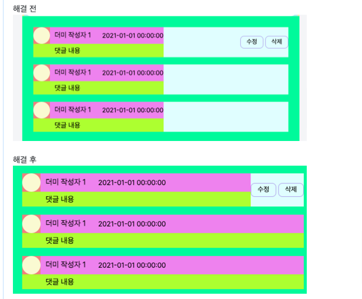
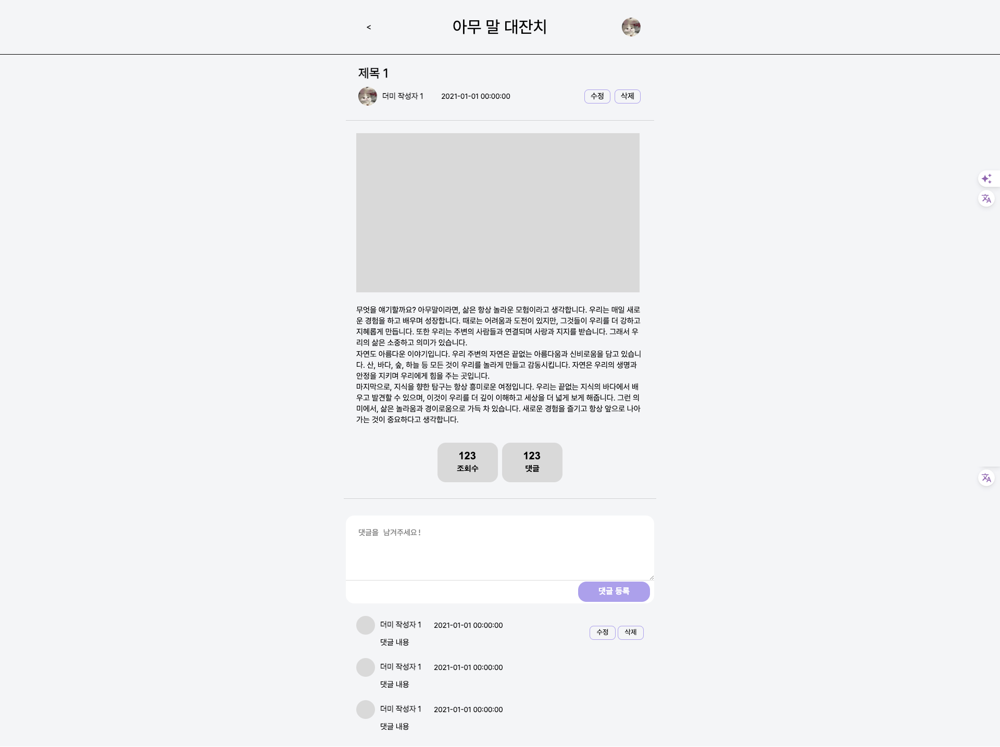

# TIL

## 날짜: 2024-04-07

### 새로 배운 내용

#### 주제 1: 알고리즘 스택/큐/덱

### 오늘의 도전 과제와 해결 방법

**문제상황**

댓글의 구조는 동일하고, `.right` 에 `.click` 클래스 유무에 따라 왼쪽영역의 가로길이를 꽉차게 설정하고 싶음.



**해결방법**
`flex-grow: 1` 을 사용하여 `.right` 가 `.click` 클래스가 없는 경우 가로전체길이를 차지할 수 있게 하도록 구현하였다.

```css
.inner .comments .left {
  background-color: greenyellow;
  flex-grow: 1;
}

inner .comments .right {
  display: none;
}

.inner .comments .right.click {
  display: block;
}
```

댓글 창 HTML 구조

```html
<div class="comments">
  <div class="left">
    <div class="top">
      <div class="img"><div></div></div>
      <div class="name">더미 작성자 1</div>
      <div class="date">2021-01-01 00:00:00</div>
    </div>
    <div class="bottom">
      <div class="comment">댓글 내용</div>
    </div>
  </div>
  <div class="right click">
    <div class="controlBtns">
      <button><a href="">수정</a></button>
      <button><a href="">삭제</a></button>
    </div>
  </div>
</div>
```




### 오늘의 회고

- 오늘의 학습 경험에 대한 자유로운 생각이나 느낀 점을 기록합니다.
- 성공적인 점, 개선해야 할 점, 새롭게 시도하고 싶은 방법 등을 포함할 수 있습니다.

### 블로그, 노션, 깃 정리 링크

- [스택, 큐, 덱 알고리즘 정리](https://sen2y-it.tistory.com/9?category=1175353)
- [feature/ 게시글 상세조회 페이지 구현 ( flex-grow: 1 ) #8
  ](https://github.com/sen2y/KakaoCloudSchool_CommunityWeb/pull/8)
