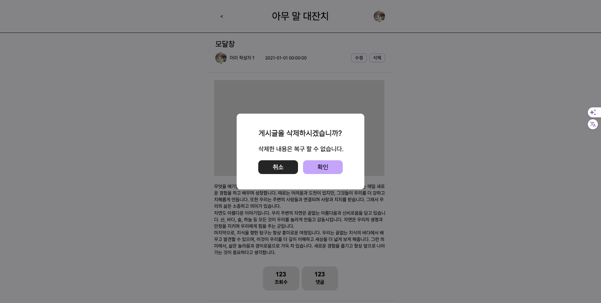
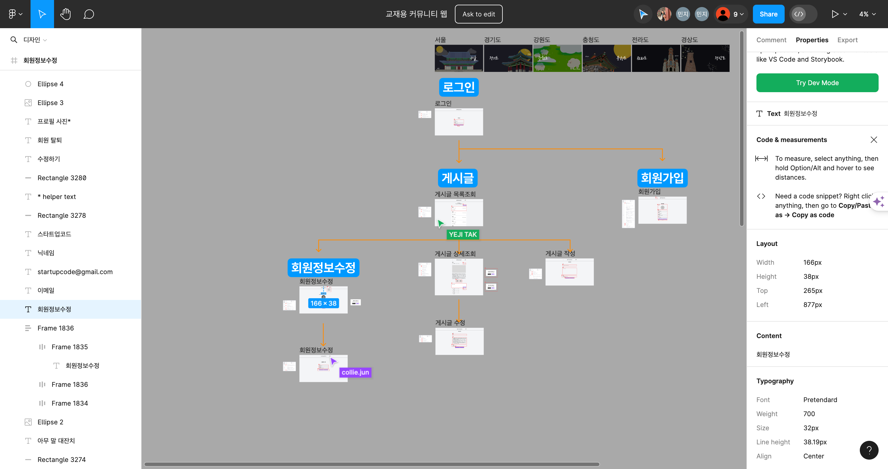
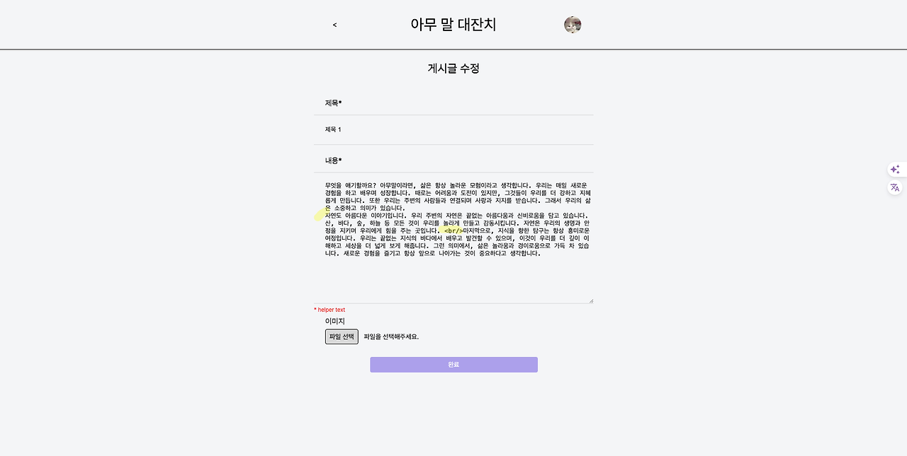
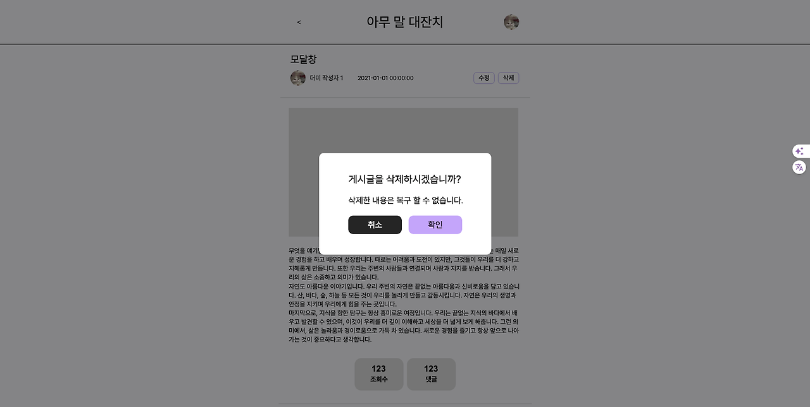
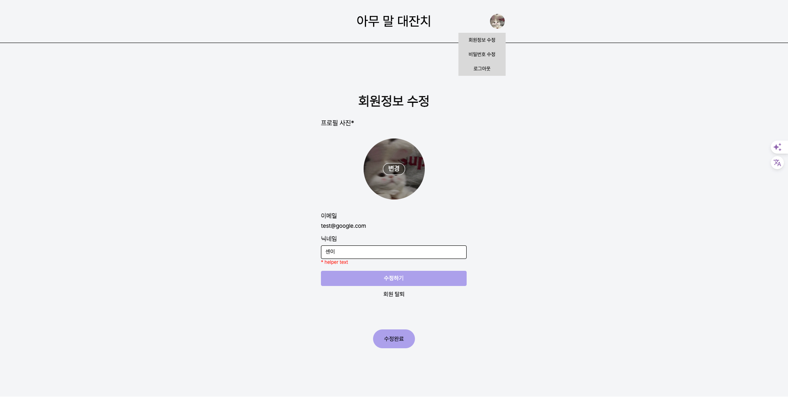
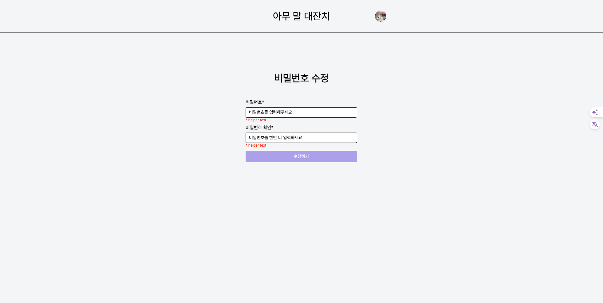

# TIL

## 날짜: 2024-04-08

### 스크럼

- 학습 목표 : 아침 스크럼에 작성한 내용 붙여넣기
- 예상되는 이슈 :
- 작일 회고 :

### 새로 배운 내용

### 2. form태그로 변경하라 하셔서 index.html, signin.html에 반영해봤는데, submit 구조 잘 구성한게 맞는지 변경코드로 다시 봐주실 수 있나요?

**변경 전**

```html
<label class="input">
  <p class="email">이메일</p>
  <input type="email" placeholder="이메일을 입력해주세요" />
</label>
```

**변경 후**

```html
<label for="email" class="input">
  이메일
  <input
    type="email"
    id="email"
    name="user_email"
    placeholder="이메일을 입력해주세요"
  />
</label>
```

`for 속성` 을 사용해서 각각 `<input>`과 연결
위와 같이 설정할 경우 서버에서 해당 post 요청을 받을 때 form data 형태로 `user_email` 값을 전달 받게 됩니다.

### 3. form에서 서버주소가 없어 이렇게 임의로 작성했는데, 저렇게 비워둬도 되는지, 그리고 그렇게 했더니 a태그에 설정한 링크가 아닌 form에 적은 서버주소로 넘어갑니다.

```
form 태그에 써있는 주소로 넘어가는게 정상입니다.
로그인 처리하고 메인 페이지로 넘기시려는것 같은데요, 이 경우에는 서버에서 적절한 작업을 하고 난 후에 클라이언트에게 302 Redirect status code 와 함께 이동시킬 url을 전달합니다. 클라이언트는 이러한 상태코드를 받으면 서버로 부터 전달 받은 URL로 브라우저 페이지를 이동 시키게 됩니다.
더 많은 내용은 구글에 http status 301 302와 비슷한 내용으로 검색해보세요
```

**변경 전**
`<a>`를 `button` 안에 넣어 제출 후 메인페이지로 이동하고자함 => 제출 시 서버주소로 넘어가는게 정상이다.

```html
<button type="submit" form="login-form" class="btn">
  <a class="login" href="./public/html/main.html">로그인</a>
</button>
```

**변경 후**

```html
<button type="submit" form="login-form" class="btn">로그인</button>
```

### 7. 피드백 반영해서, 회원가입페이지에서도 form으로 변경핶는데, 이렇게 이미지와, 텍스트를 한번에 form으로 감싸도 되는지 궁금합니다.

=> 상관 없습니다.

### 8. 그리고 이미지 첨부를 js없이 html,css로 구현하기위해 for로 라벨 묶어서 만들고 원래 인풋은 숨김처리. => 파일 선택창까지는 뜨는데, 선택한 이미지가 해당 요소안에 뜨지는 않습니다. js를 사용안하면 안되는게 맞나요?

- 네!
- HTML/CSS 는 정적인 마크업과 스타일링을 위한 기술이며 사용자의 인터렉션과는 무관합니다

  - `유저가 파일을 선택 -> 선택한 파일을 띄운다`
    - 어떻게? -> 자바스크립트를 이용해서
    - 무엇을? -> 유저가 선택한 이미지 파일을
    - 어디에? -> 자바스크립트로 새롭게 생성한 이미지 엘리먼트에 페이지에 새로 삽입한다.

- 아래는 예시코드입니다.

```javascript
<input type="file" id="profileUpload" name="profilePicture" onchange="displayImage(this)"/>


<script>
function displayImage(input) {
  var file = input.files[0]; // 선택된 파일 가져오기
  if (file) {
    var reader = new FileReader();
    reader.onload = function(e) {
      var profileImage = document.getElementById('profileImage');
      profileImage.src = e.target.result;
      profileImage.style.display = 'block'; // 이미지를 보이게 설정
    }
    reader.readAsDataURL(file); // 파일 읽기
  }
}
</script>
```

### 오늘의 도전 과제와 해결 방법

- 도전 과제 1: feature/ 게시글 상세조회 모달창 버전 구현 ( 클래스 유무에 따른 숨김처리, 스크롤, 배경클릭막기 ) #10

```jsx
 <body class="shadow">
```

```html
<div class="shadow popClick">
  <div class="modal">
    <h3>게시글을 삭제하시겠습니까?</h3>
    <p>삭제한 내용은 복구 할 수 없습니다.</p>
    <div class="btns">
      <div class="cancel">취소</div>
      <div class="delete">확인</div>
    </div>
  </div>
</div>
```

```css
// 모달창 활성화 시, 배경페이지 스크롤, 클릭 안됨 + 배경 검정 50% 불투명도

body.popClick {
  overflow: hidden; // 스크롤 불가
}

.inner .shadow {
  display: none; // 비활성화 시에는 화면에 안보이게 숨김
}

.inner .shadow.popClick {
  display: block; // 화면에 등장
  position: fixed;
  top: 0;
  left: 0;
  width: 100%;
  height: 100%;
  background-color: rgba(0, 0, 0, 0.5);
  z-index: 1;
}
```



- 도전 과제 2: feature/ 전체 페이지 구현 완료 ( textarea 줄바꿈 - &#10; )
  피그마
  

`<input>` 창에 값 미리 넣을땐 `value` 사용

`textarea`창에 값 미리 넣을땐 태그 사이에 값을 넣으면 된다.

`textarea`에서, 줄바꿈을 하려면?

`&#10;` 사용해야 줄바꿈 처리된다. `<br/>` 태그는 위 사진처럼 그대로 출력된다.

```html
<textarea class="content2" placeholder="내용을 입력해주세요.">
 무엇을 얘기할까요? 아무말이라면, 삶은 항상 놀라운 모험이라고 생각합니다. 우리는 매일 새로운 경험을 하고 배우며 성장합니다. 때로는 어려움과 도전이 있지만, 그것들이 우리를 더 강하고 지혜롭게 만듭니다. 또한 우리는 주변의 사람들과 연결되며 사랑과 지지를 받습니다. 그래서 우리의 삶은 소중하고 의미가 있습니다. &#10;자연도 아름다운 이야기입니다. 우리 주변의 자연은 끝없는 아름다움과 신비로움을 담고 있습니다. 산, 바다, 숲, 하늘 등 모든 것이 우리를 놀라게 만들고 감동시킵니다. 자연은 우리의 생명과 안정을 지키며 우리에게 힘을 주는 곳입니다. <br/>마지막으로, 지식을 향한 탐구는 항상 흥미로운 여정입니다. 우리는 끝없는 지식의 바다에서 배우고 발견할 수 있으며, 이것이 우리를 더 깊이 이해하고 세상을 더 넓게 보게 해줍니다. 그런 의미에서, 삶은 놀라움과 경이로움으로 가득 차 있습니다. 새로운 경험을 즐기고 항상 앞으로 나아가는 것이 중요하다고 생각합니다.</textarea
>
```



```jsx
 <body class="shadow">
```

```html
<div class="shadow popClick">
  <div class="modal">
    <h3>게시글을 삭제하시겠습니까?</h3>
    <p>삭제한 내용은 복구 할 수 없습니다.</p>
    <div class="btns">
      <div class="cancel">취소</div>
      <div class="delete">확인</div>
    </div>
  </div>
</div>
```

```css
// 모달창 활성화 시, 배경페이지 스크롤, 클릭 안됨 + 배경 검정 50% 불투명도

body.popClick {
  overflow: hidden; // 스크롤 불가
}

.inner .shadow {
  display: none; // 비활성화 시에는 화면에 안보이게 숨김
}

.inner .shadow.popClick {
  display: block; // 화면에 등장
  position: fixed;
  top: 0;
  left: 0;
  width: 100%;
  height: 100%;
  background-color: rgba(0, 0, 0, 0.5);
  z-index: 1;
}
```


회원정보, 비밀번호 수정 페이지 구현



### 오늘의 회고

- 오늘의 학습 경험에 대한 자유로운 생각이나 느낀 점을 기록합니다.
- 성공적인 점, 개선해야 할 점, 새롭게 시도하고 싶은 방법 등을 포함할 수 있습니다.

### 블로그, 노션, 깃 정리 링크

깨진 이미지는 하단 깃헙 링크로 들어가면 원본이미지 확인 가능하다.

-[[완료] 코드리뷰 (2) #13](https://github.com/sen2y/KakaoCloudSchool_CommunityWeb/pull/13)

- [feature/ 게시글 상세조회 모달창 버전 구현 ( 클래스 유무에 따른 숨김처리, 스크롤, 배경클릭막기 ) #10](https://github.com/sen2y/KakaoCloudSchool_CommunityWeb/pull/10)
- [feature/ 전체 페이지 구현 완료 ( textarea 줄바꿈 - &#10; ) #11](https://github.com/sen2y/KakaoCloudSchool_CommunityWeb/pull/11)
