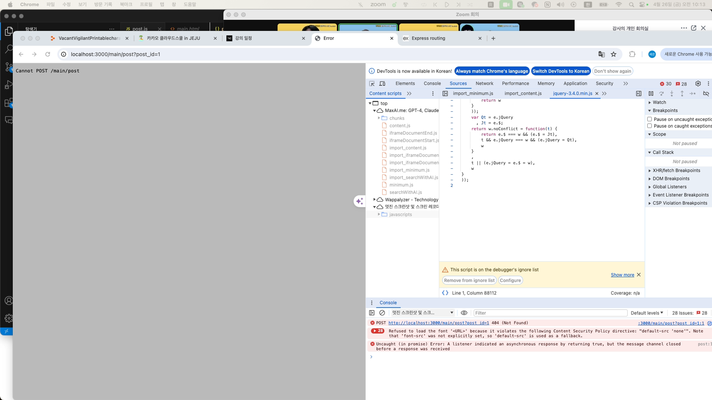

# TIL

## 날짜: 2024-04-27

### 오늘의 도전 과제와 해결 방법

- 도전 과제 1: 댓글 작성은 되는데, 상태코드 201을 넘겨주지 못하는지 페이지 넘길 때 문제가 생긴다.



```javascript
// 현재 오류 : 댓글 작성은 되는데, 상태코드 201 을 넘겨주지 못하는지 페이지넘길때 문제가 생긴다.
commentForm.addEventListener("submit", async (event) => {
  event.preventDefault();
  fetch(`http://localhost:4000/posts/${postId}/comment`, {
    method: "POST",
    headers: {
      "Content-Type": "application/json",
    },
    body: JSON.stringify({
      comment: commentEl.value,
      user_id: "583c5484cb79a5fe593425a9",
      nickname: "조용한낙타",
      profileImagePath:
        "https://i.pinimg.com/564x/3e/fc/6e/3efc6e820481b9125452a0bd93b56781.jpg",
      created_at: new Date(),
    }),
  });
  const data = response.json();
  console.log(data);
  if (response.status === 201) {
    alert("댓글이 등록되었습니다.");
    location.href = `/main/posts/?post_id=${postId}`;
  }
});
```

💁‍♂️ 해결 : fetch에 대한 response응답이없는것이 문제였다. response응답을 .then을 통해 선언해주고 사용하니 해결 완료 !

```javascript
// 해결 코드
commentForm.addEventListener("submit", async (event) => {
  event.preventDefault();
  fetch(`http://localhost:4000/posts/${postId}/comment`, {
    method: "POST",
    headers: {
      "Content-Type": "application/json",
    },
    body: JSON.stringify({
      comment: commentEl.value,
      user_id: "583c5484cb79a5fe593425a9",
      nickname: "조용한낙타",
      profileImagePath:
        "https://i.pinimg.com/564x/3e/fc/6e/3efc6e820481b9125452a0bd93b56781.jpg",
      created_at: new Date(),
    }),
  }).then((response) => {
    const data = response.json();
    console.log(data);
    if (response.status === 201) {
      alert("댓글이 등록되었습니다.");
      location.href = `/main/posts/?post_id=${postId}`;
    }
  });
});
```
