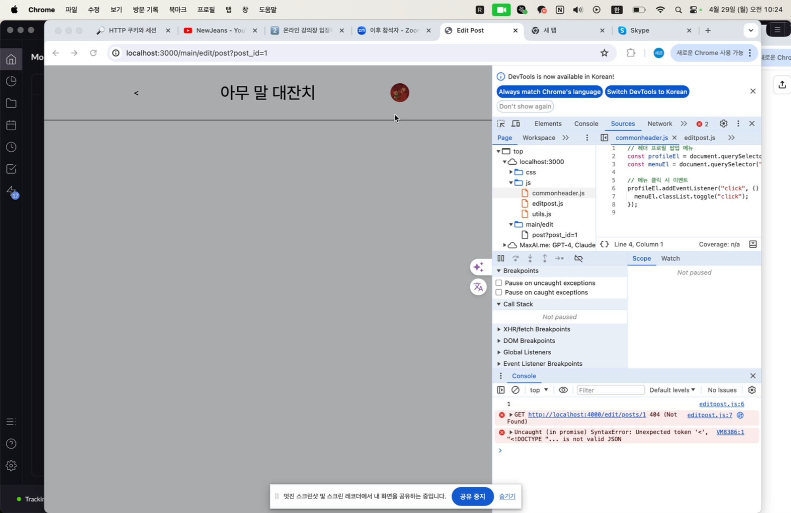
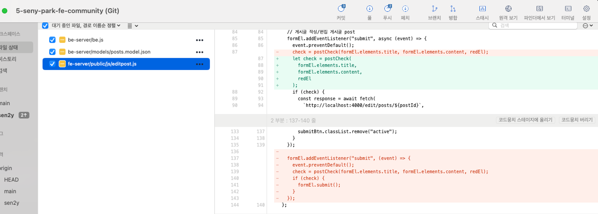

# TIL

## 날짜: 2024-04-29

### 스크럼

- 학습 목표 : 과제3, 보강 내용정리
- 예상되는 이슈 : 수업 전까지 끝낼 수 있을까?
- 작일 회고 : 주말에 쉬었다. 초심을 잃었다. 다시 열심히하자.

### 오늘의 도전 과제와 해결 방법

- 도전 과제 1: 게시글 수정 페이지에서 be-server에 get요청을 보내는데, 계속 넘어오지 않고 에러가 뜨는 상황
  

💁‍♂️ **문제 해결** : 아래에서 경로에 /로 시작을 해야하는데, /누락하고 edit부터 시작해서 정상적으로 연결이 안되었다.

```javascript
pp.get("/edit/posts/:postId", (req, res) => {
  const postId = req.params.postId;
  console.log(`PostId: ${postId}`);
  fs.readFile(filePostsPath, "utf-8", (err, data) => {
    if (err) {
      return res.status(500).send("게시글 불러오기에 실패했습니다.");
    }
    const posts = JSON.parse(data);
    const post = posts.find((post) => post.post_id === Number(postId));
    res.json(post);
  });
});

app.post("/edit/posts/:postId", (req, res) => {
  const postId = req.params.postId;
  const { title, content } = req.body;
  console.log(`Title: ${title}, Content: ${content}`);
  fs.readFile(filePostsPath, "utf-8", (err, data) => {
    if (err) {
      return res.status(500).send("게시글 불러오기에 실패했습니다.");
    }
    const posts = JSON.parse(data);
    const post = posts.find((post) => post.post_id === Number(postId));
    console.log(post);
    post.post_title = title;
    post.post_content = content;
    post.updated_at = new Date();
    fs.writeFile(filePostsPath, JSON.stringify(posts, null, 2), (err) => {
      if (err) {
        return res.status(500).send("게시글 수정에 실패했습니다.");
      }
      return res.status(201).send("게시글 수정 성공");
    });
  });
});
```

- 도전 과제 2: 이미지 파일이 존재하는 경우에만 화면에 출력하고 싶은데, 없는 경우에도 가져오려고 시도하다가 에러메시지 출력되는 상황


```javascript
// 오류코드
{postData.attach_file_path ?  : ""}
// 이 부분 오류나는 상황. 내 의도는 해당 데이터 있는경우에만 이미지 태그넣게 하고 싶었다.
```

```javascript
// 해결 코드
${postData.attach_file_path ? `` : ""}
```

- 도전 과제 3: 코드 옮기고 수정하는 과정에서, 코드가 겹치면서 의도치 않은 문제들이 생기고 있다.

  **제발 코드 옮길 때 잘 확인하자**

  ```
  submit 코드가 겹치는줄 모르고 alert는 잘 뜨는데 왜 자꾸 이상한 페이지로 이동하는건지 이해가 안갔음.
  알고보니 submit eventlistener가 코드 하단에 하나 더있었고, .submit()을 수행해서 생기는 문제였음.
  제발제발 코드 옮길때 잘 확인하자. !!
  ```

  
