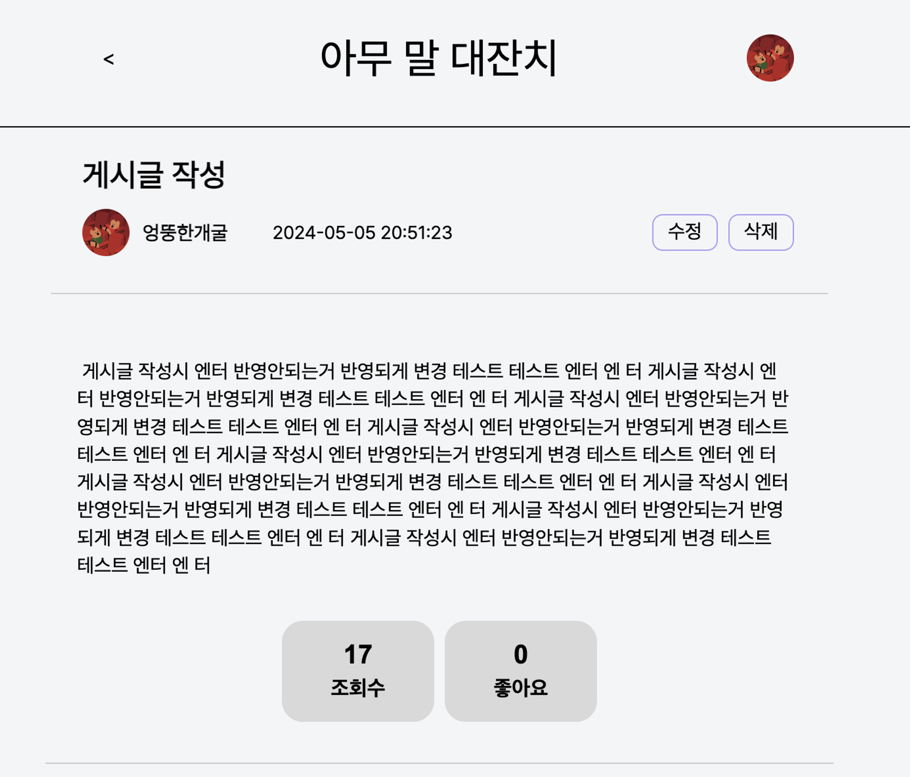
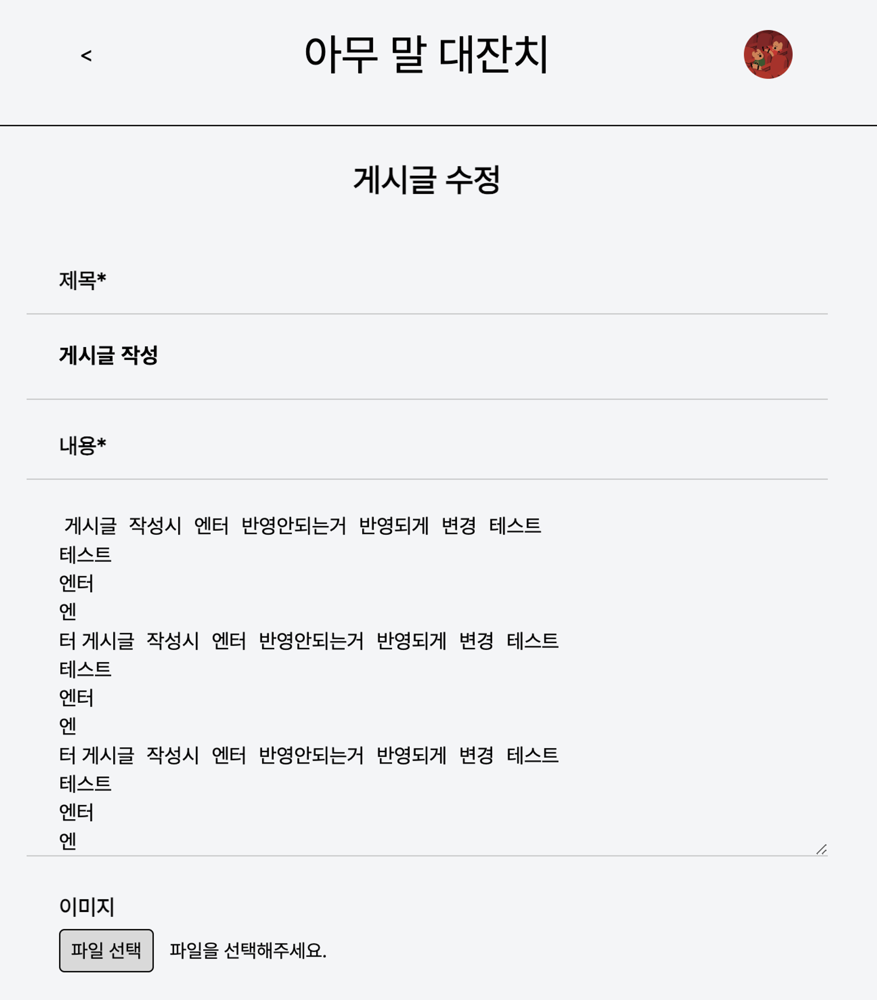

# TIL

## 날짜: 2024-05-05

### 새로 배운 내용

#### 주제 1: ESModule → commonJS 도입, 백엔드에서는 commonJS를 사용하는 것이 좋다.

### 오늘의 도전 과제와 해결 방법

- 도전 과제 1: textarea 에 엔터를반영해서 게시글 작성해도 렌더링시에 엔터가 나타나지 않음
  💁‍♂️ `contentEl.value.replace(/\n/g, "<br>")` 활용하기

```javascript
// 문제 코드
if (check) {
  const response = await fetch(`http://localhost:4000/edit/posts/${postId}`, {
    method: "POST",
    headers: {
      "Content-Type": "application/json",
    },
    body: JSON.stringify({
      title: titleEl.value,
      content: contentEl.value.replace(/\n/g, "<br>"),
    }),
  });
  console.log(response);
  if (response.status === 201) {
    alert("게시글이 수정되었습니다.");
    location.href = `/main/post?post_id=${postId}`;
  } else if (response.status === 500) {
    alert("게시글 수정에 실패했습니다.");
  }
}
```

수정 전





#### 💁‍♂️ 다음과 같이 변경

```javascript
body: JSON.stringify({
            title: titleEl.value,
            content: contentEl.value.replace(/\n/g, "<br>"),
          }),
```

수정 후


### 오늘의 회고

- 알고리즘 문제를 나눠서 풀어야하는데.. 과제도 밀리고 알고리즘도 밀리니 참 문제다.

### Git pr 참고 자료 및 링크

- [feature/ 댓글 수정, 댓글 삭제, 게시글 삭제 구현 및 게시글 엔터 렌더링 반영 #4](https://github.com/100-hours-a-week/5-seny-park-community/pull/4)
- [feature/ routes-controller-model 구성으로 코드 리팩토링 + be-server CommonJS로 변경 #5](https://github.com/100-hours-a-week/5-seny-park-community/pull/5)
