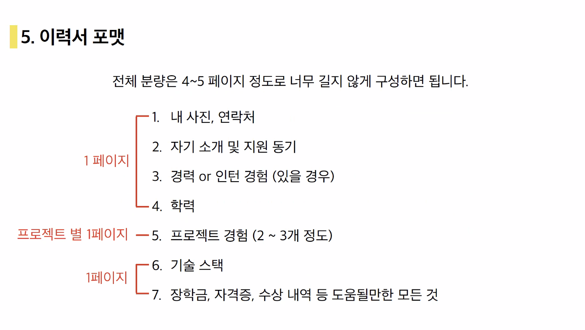

# TIL

## 날짜: 2024-05-09

### 스크럼

- 학습 목표 : 네트워킹 파티 D-DAY! 새로운 것들 많이 배워오자 !
- 예상되는 이슈 : 네트워킹 파티, 과제할 시간이 부족할 것 같다.
- 작일 회고 : 전날 디코 모각코 채널에서 카메라를 키고 참여하니 집중이 더 잘 됐다. 앞으로도 카메라 키고 집중할 예정이다.

### 새로 배운 내용

#### 포트폴리오 작성 특강

1. 개발자 이력서는 어떻게 작성해야 할까?
1. 나의 경쟁력 파악하기.
1. 읽을 사람 파악하기.
1. 스토리 잡기 🌟🌟🌟
1. 이력서 포맷

   

### 오늘의 회고

- 단순히 프로젝트만 열심히 하는 것이 아닌, 이력서와 코테 모두 지금부터 잘 준비해야함을 잘 느꼈다.
- 초심 찾고 다시 잘 해보자
