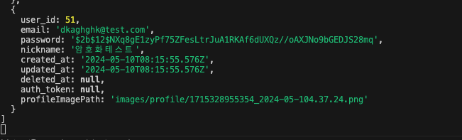

# TIL

## 날짜: 2024-05-10

### 스크럼

- 학습 목표 1 : 과제 2주차 3번 과제 진짜 마무리하기!
- 예상되는 이슈 : 오전에 병원가야해서 과제할 시간이 부족할 것 같다.
- 작일 회고 : 전날 네트워킹 파티 참석으로 인해 과제 진행을 못했다.

### 새로 배운 내용

#### 주제 1: multer 사용해서 서버에 저장된 파일 불러오기

- 기존 코드 문제점 : 서버에 저장된 이미지를 background-image로 넣으려고할때 주소를 넣으면, 그건 자동으로 서버에 요청을 보내는것과 동일. 하지만 위 오류났던 코드처럼 그냥 서버내 파일경로만 기입하면 프론트서버 3000번 이후 주소가 붙어 올바르게 이미지를 받아올수없다.

  💁‍♂️ 서버에서 이미지를 받아올때도 http://localhost:4000으로 요청을 보내야하기 때문에 서버주소부터 포함하여 정확한 주소를 넣어줘야 이미지가 받아와진다.

```javascript
// 오류났던 코드
<div class="mid" style="background-image: url('${userData.profileImagePath}')">
```

- 그리고, 서버의 정적 파일에 접근하기 위해 be-server에서 미들웨어로 static 지정이 필요했다.

```javascript
// 정적 파일 제공을 위한 미들웨어
app.use(express.static("images"));
```

```javascript
// 해결 코드
<div class="mid" style="background-image:
	url('<http://localhost:4000/${userData.profileImagePath.slice(7)}')">
```

#### 주제 2: bcrypt 비밀번호 암호화

- 그동안 회원가입할 때, 사용자의 비밀번호를 서버에 그대로 저장해왔다.
- 해당 방법은 보안 문제가 매우 취약하다.  
  💁‍♂️ bcrypt를 사용하여 간단하게 회원가입시, 암호화된 비밀번호를 서버에 저장하고, 매 로그인요청시마다 입력값을 암호화하여 저장된 값과 비교하는 방식으로 구현해보았다.

  ```javascript
  const bcrypt = require("bcrypt");
  ```

  ```javascript
   const hashedPassword = bcrypt.hashSync(password, 12); // 비밀번호 암호화
   .
   .
   .
   // 서버에 암호화된 비밀번호를 저장
   users.push({
      user_id: users.length + 1,
      email: email,
      password: hashedPassword,
      nickname: nickname,
      created_at: new Date(),
      updated_at: new Date(),
    })
  ```

  ```javascript
      // 매 로그인 요청시마다 입력값과 서버에 저장된 hashed 비밀번호 대조
      // bcrypt.compareSync(입력한 비밀번호, 암호화된 비밀번호)
    if (!bcrypt.compareSync(password, user.password)) {...}
  ```

- 서버에 저장 결과 예시
  

### 오늘의 회고

- 드디어 2주차 3번과제 바닐라 js 커뮤니티 과제를 끝냈다. 이제 인증/인가인데, 처음해보지만 겁먹지 말고 차근차근 잘해보자!

### 참고 자료 및 링크

- git pr 바로가기 → [feature/ (인증인가 전까지 마무리)서버에 저장된 정적파일 프론트에 가져오기, 비밀번호 암호화(bcrypt), 미완코드 구현, 코드리팩토링 #7](https://github.com/100-hours-a-week/5-seny-park-community/pull/7)
